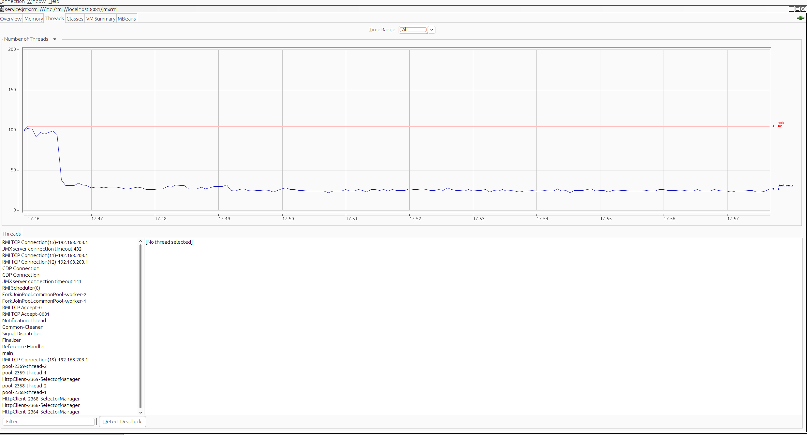
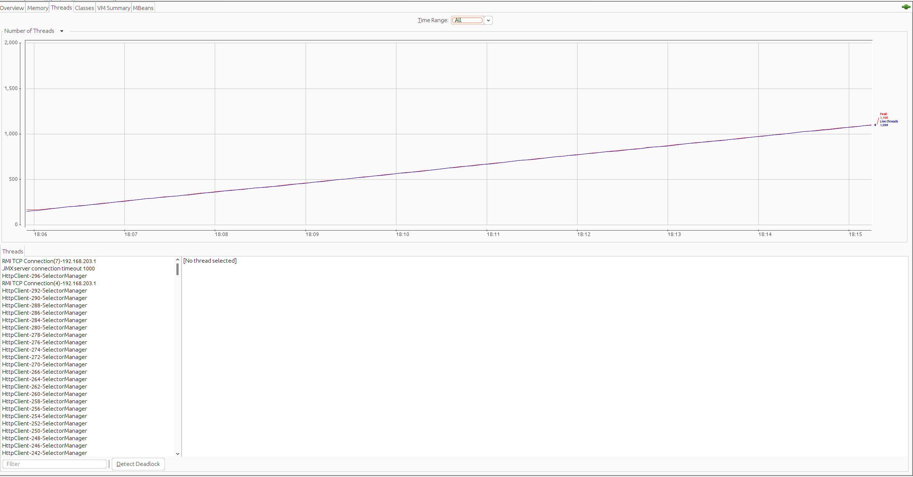

## Selenium memory leak repro
### How to run
1. You can tune to use jdk http client or not and jre version using env and build arg variables in docker-compose file. After setting required variabled, run program using ./run.sh. After running should see that some work is performed in selenium docker containers by observing logs. 
2. Connect to app using jmx, to overview number of thread and other stats
```shell
  jconsole -J-Dcom.sun.management.jmxremote.ssl=false  service:jmx:rmi:///jndi/rmi://localhost:8081/jmxrmi
```
3. To check free memory in docker use command:
```shell
  docker stats sel-repro-app-1
```
Reproducible example doesn't open any sites, just spawns new instances of selenium and closes them.

### Description
1. Large number of threads spawned on jre 17 using jdk http client. Not reproducible on jre20 :
 _jre 20_:

 _jre 17_:

2. Memory leak - if you run enough time the application it will reach the limit of RAM. With current configuration at start up application running jre 20 consumes about ~250mb, after 10m according to docker stats it consumes ~450mb, and after performing full gc memory footprint stays same 
